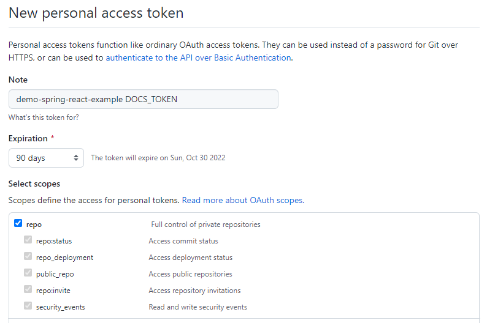
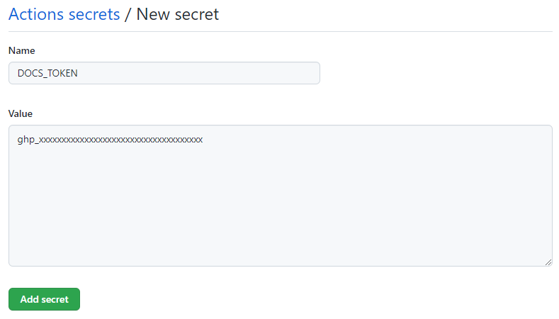
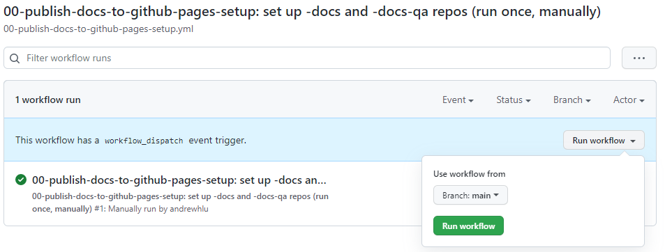

# Storybook

Storybook is an open-source development tool for React applications. Storybook allows components and pages to be isolated and "mocked" in development environments without needing to launch the entire application. Storybook also acts as a "library" for all of a project's React components through the use of "stories". Storybook runs on Node separately from the React frontend, and can also be built into a static webpage and deployed to a hosting site such as GitHub Pages.

In CMPSC 156, Storybook is introduced in team03 and the legacy code projects. Students are encouraged to follow the development lifecycle with Storybook, generating "production" and "QA" storybooks for all team applications. These allow for easy review of components in pull request code reviews.

Storybook's documentation for React can be found [here](https://storybook.js.org/docs/react/get-started/introduction).

An example of a deployed Storybook for [ucsb-cs156/demo-spring-react-example](https://github.com/ucsb-cs156/demo-spring-react-example) is here:
* [Production](https://ucsb-cs156.github.io/demo-spring-react-example-docs/)
* [QA Docs](https://ucsb-cs156.github.io/demo-spring-react-example-docs-qa/)

## Running Storybook Locally

First, navigate to a project's `frontend` directory and install all Node project dependencies, including Storybook, using `npm i`. 

Then, start the Storybook in development mode using `npm run storybook`.

Note that Storybook is a tool to show UI changes only, and cannot make any backend API calls or interact with actual data. Any example data must be pre-filled using Stories. Because of this, **it is not necessary to start the Java backend or the React frontend to use Storybook**.

Our `package.json` defines the port for Storybook to be 6006, so Storybook will be viewable by navigating to http://localhost:6006 in a web browser after running in development mode.

Like running a React application in development mode, **Storybook will hot-reload any changes to components when run in development mode**. This makes it a particularly useful tool for designing UI components from scratch, as any changes made will be instantly reflected in Storybook and developers do not have to wait for an end-to-end implementation to be available to test visual changes.

## Setting Up Storybook Production and QA Builds

To assist with the code review workflow, and to encourage further use of the QA and Production development lifecycle, we establish a set of GitHub Actions workflows that will automate the process of building a static Storybook build and deploying it to GitHub Pages for viewing. 

These workflows make use of two additional repositories to aid in the deployment of Storybook to GitHub Pages. A "production" Storybook workflow builds and deploys a Storybook to a primary `-docs` repository for every  push to the `main` branch, and a "QA" Storybook workflow handles building and deploying to a secondary `-docs-qa` repository for any open pull requests on the project repository.

The steps below outline how to set up the Storybook repositories and GitHub Actions workflows. 

### Step 1: Create a "Personal Access Token"

**Note that this token will grant access to every repo within the token creator's account.** Although our workflows will only use it for the purposes of pushing to specific repos within our organization, and the value cannot be seen again once it is added as a secret, there is always some risk of misuse by students. Staff should be on the lookout for misuse in code reviews.

1. Visit the [GitHub homepage](https://github.com/) and sign in to the token creator's GitHub account.
2. Navigate to the ["Personal access tokens" settings page](https://github.com/settings/tokens).
   * You can also get here by:
      1. Selecting your avatar on the top right corner and clicking "Settings"
      2. Clicking on "Developer settings" at the bottom of the left sidebar
      3. Clicking on "Personal access tokens" on the left sidebar
3. Click the button to "Generate new token" on the top right. Enter your password if prompted.
4. Name your token. Since this token is single-use for a specific purpose, you can place the name of the repo that it will be used for here.
   * e.g. `demo-spring-react-example DOCS_TOKEN`
5. For expiration, we recommend selecting at least 90 days.
   * This will ensure that the token will be valid at least until the end of the course.
6. For scopes, select the top-level "repo" scope, which grants full control of private repositories. This will automatically check all other items in the "repo" category.

    

7. Click "Generate token" in green on the bottom of the page.
8. **Copy the value of your newly-generated personal access token. Paste it somewhere safe outside of any code repositories.** You won't be able to see it again after you close the page.
   * The token string should start with `ghp_`

### Step 2: Set the value of `DOCS_TOKEN`

1. Navigate to the Settings page of the repository that you are looking to enable Storybook on.
2. On the left sidebar, under "Security", click "Secrets" and then "Actions".
3. On the top right, next to "Actions secrets", click "New repository secret".
4. Under "Name", enter `DOCS_TOKEN`.
5. Under "Value", paste your newly-generated personal access token from above. Ensure that there are no extra characters or line breaks.

    

6. Click "Add secret" to save the new token value.

### Step 3: Create and set up `-docs` and `-docs-qa` repos

With the help of GitHub Actions workflow dispatch, provisioning of both the production `-docs` and QA `-docs-qa` repos is as simple as manually running one [GitHub Actions workflow](https://github.com/ucsb-cs156/demo-spring-react-example/blob/main/.github/workflows/00-publish-docs-to-github-pages-setup.yml). Specifically, this workflow will accomplish the following:

* Create the `-docs` and `-docs-qa` repos in the owning organization (if they don't already exist)
* Enable GitHub Pages from the `main` branch's `/docs` directory (if not already enabled)
* Edit the descriptions and homepage URLs of the new repos to point to their respective GitHub Pages deployments

Assuming that the project repository is initialized with the code / workflows from the latest [demo-spring-react-example](https://github.com/ucsb-cs156/demo-spring-react-example), we can run the creation workflow as follows:

1. Navigate to the project repository.
2. On the repository navigation bar, select the "Actions" tab.

    

3. On the left sidebar, select the Actions workflow titled `00-publish-docs-to-github-pages-setup: set up -docs and -docs-qa repos (run once, manually)`
4. In the blue dialog that states "This workflow has a `workflow_dispatch` event trigger.", click on "Run workflow", then "Run workflow" again.

    

The workflow should only take a few seconds to run and should only be run once for each repo. You can view the output of each step by clicking on the new workflow run and viewing the results of the "build-and-deploy" job. The workflow is designed to continue even if a step fails, so a successful workflow run may not mean that everything went well.

## Creating / Deploying a New Storybook Build

Storybook is ready to be used after a `DOCS_TOKEN` is added and the initial setup workflow is run to create the -docs repositories. As long as GitHub Actions is enabled within the repository, Storybook builds will be automated on new commits.

**New commits to the `main` branch will start a new production Storybook build**. This includes any merges from pull requests. New production builds will always replace previous production builds, so the production Storybook deployment will always reflect the latest merged code.

**New pull requests, or pushes to branches with open pull requests, will start a new QA Storybook build**. Unlike production branch builds, the QA repository is designed to hold multiple builds, one for each branch. New branches will create a new subdirectory in the QA docs repo, and subsequent builds for the same branch will replace the previous QA build for that branch. The root homepage of the QA Storybook includes links to each Storybook branch and its corresponding PR. Note, however, that we currently do not have the tooling to delete Storybook branches that are *merged* or *closed*. 
