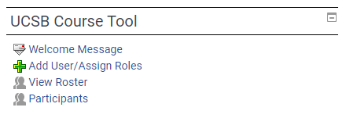

# Initial Setup

## Initial Student Email

Once most of the course infrastructure is set up (notably GitHub, the UCSB CS GitHub Linker, and Slack), we need to invite the class to join our organizations on each platform. As GauchoSpace is designed to automatically sync with the Registrar, it is the one place staff can go to send class-wide announcements to the class before students join the course Slack (or if Slack is otherwise unavailable).

The UCSB Course Tool in GauchoSpace allows instructors to create a "Welcome Message", which will be sent to every newly-enrolled member of a course within a few hours of joining. This includes enrollments through GOLD / the registrar, as well as manual student enrollments directly in GauchoSpace. We'll use this to ask students to join the Slack, join the GitHub organization, and complete the initial CATME survey for team formation.

A sample welcome message from Spring 2022 is available below. This email only asks students to join the Slack and GitHub, but it may also be a good idea to also ask students to sign up for GitHub Student Developer Pack and complete the CATME team formation survey in this email as well.

> Welcome to CMPSC 156 for S22!
>
> Even though we are still a few days away from the end of Winter 2022, I'm already looking forward to Spring 2022 and getting things set up for CMPSC 156.
> 
> The first thing is that I've set up a Slack workspace for us to use during the course. CMPSC 156 is all about learning real world practices for software development, and the use of team communications tools is one of those. That's why we use Slack, a tool originally developed for software development teams.
>
> Please use this link to join the Slack. When you do, please use your UCSB email address (i.e. ___@ucsb.edu). It doesn't matter if you already use a different email for some other Slack workspaces; each Slack workspace is a separate domain in terms of username/email/password credentials. Using your UCSB email allows us to tie your Slack activity back to your identity as a student and give you credit for the activities you participate in on Slack.
>
> [Slack invitation link]
> 
> Then, please join the class GitHub organization here. Use your GitHub ID to login, click on ucsb-cs156-w22 to join the class organization, then click to accept the invitation to the course organization. If it doesn't work, check that your UCSB email (either @umail.ucsb.edu or @ucsb.edu) is added to your GitHub account.
>
> <https://ucsb-cs-github-linker.herokuapp.com>
> 
> I'll be sharing more news about CMPSC 156 as we get closer to our first class meeting on Tuesday March 29, in SH 1431.
>
> In the meantime, good luck with your Winter quarter classes.
>
> Regards,
> 
> Phill Conrad
>
> PS: If you have any class conflict / time overlap between any of your other classes, and any of your scheduled lecture/discussion times for CMPSC 156, please contact me ASAP. Because this class involves group work, often during lecture and discussion, it is essential, out of fairness to the rest of your team, that you be available for full synchronous participation for the entire course period for all lectures/discussions, with no exceptions. (Occasional unavoidable absences due to illness, etc. are acceptable; a regular every week absence due to a schedule conflict is not.)
>
> I will be checking, so to avoid disappointment later, don't ignore this if you have conflicts; let's resolve it now.

1. Login to the instructor's GauchoSpace account and navigate to the course.
2. On the right sidebar, under "UCSB Course Tool", select "Welcome Message".

    

3. Complete the form with your desired welcome email:
   * The "Start Sending" field lists the *earliest* date at which students will receive this email. Generally, the start date is well before the quarter starts, as soon as students start enrolling on GOLD. This is due to the large amount of prep work that has to occur before Day 1.
   * "Subject" is your typical email subject. **Don't forget to place a value here after the initial class tag `[CMPSC 156 - XXX]`!**
   * "Body" is the actual contents of the email. This editor allows for rich editing, so add clickable links wherever links are posted.
   * Check "Bypass Availability". This allows emails to be sent without making the course available, and ensures that students will see the email as early as possible.
   * Save changes 

## Team Roster Import
