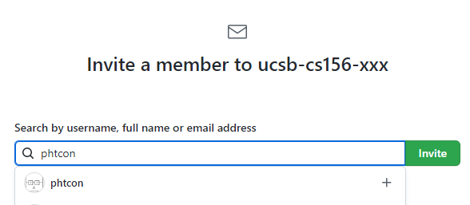

# Setting up the UCSB CS GitHub Linker

These instructions assume that you have already followed the steps to create a new GitHub organization for your desired instance of the course. The instructions can be found [here](../github/2-initial-setup.md).

## Step 1: Request instructor access to the GitHub Linker

In order to create a class on the UCSB CS GitHub Linker, you'll need to hold  the "Instructor" role (or higher) in the GitHub Linker tool. 

1. If this is your first time using the GitHub Linker, [sign in](https://ucsb-cs-github-linker.herokuapp.com/) with your GitHub account on the website homepage to establish your account in the system.
   * Note that this system does not handle GitHub username changes well, so avoid changing your username after your first login if possible!
2. Reach out to Phill Conrad at <phtcon@ucsb.edu>, or another administrator of the tool, to grant you the "Instructor" role. 
   * When making your request, provide your GitHub username - that is how we will identify your account.
   * An admin can log into the app, go into the "Users" tab, search for your username, click on your current role, and change your role in the revealed dropdown.

Note that *only the creator* of the course needs instructor access - other staff members, such as TAs and ULAs, should *not* be granted this role and can be added into the course as a TA later on.

## verify instructor role

## Step 2: Add @phtcon as an owner in your GitHub organization

The operation of the UCSB CS GitHub Linker is reliant on a GitHub machine account for much of its functionality. In order for any of the tooling to work, we'll need to add that machine user as an owner within the newly created GitHub organization.

For the main instance of the app, the machine user is `@phtcon`. This account belongs to Phill Conrad, and the account's profile picture looks like this:

1. Navigate to your organization's page at github.com/ucsb-cs156-xxx.
2. Click on the "People" tab to get to the list of members.
3. On the top right, click "Invite member"
4. Enter `phtcon` in the box, select their name from the dropdown list, and click "Invite". Enter your password if prompted.

    

5. Select the "Owner" role and send the invitation.

You'll need to wait for Phill Conrad to accept the invitation before you can proceed to the next step.

(It's possible that the account is set to auto-accept any account that sends it an invitation... if that's the case, you don't have to wait.)

## Step 3: Create a course in the GitHub Linker tool

