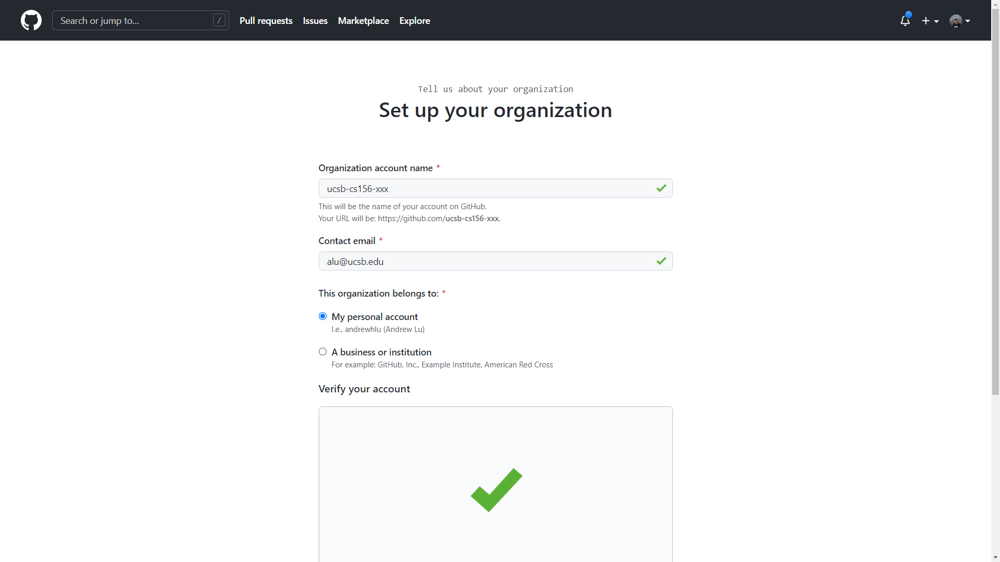

# Setting up a GitHub Organization

## Step 1: Create a new GitHub Organization

Each instance of CMPSC 156 should have its own GitHub organization. This allows the staff to properly set up access control for students to their repos, and for staff to have administrative rights to only the repos for the course iterations they are a staff for.

1. Visit the [GitHub homepage](https://github.com/) and sign in to the instructor's primary GitHub account.
2. When signed in, navigate to [this page](https://github.com/organizations/plan) to create a new organization.
    * You can also get here by selecting "+" on the top right corner and clicking "New organization".
    * The page should look like this:

        

1. Select "Create a free organization" under the "Free" plan. (Don't worry, you'll upgrade to the "Team" plan with your GitHub Education benefits later.)
2. Complete the form to create your organization:
   1. For organization account name, enter `ucsb-cs156-xxx`, where `xxx` is replaced with the short form quarter code for this iteration of the class in lowercase (e.g. "s22" for Spring 2022).
   2. For contact email, enter the instructor's UCSB email.
   3. For "This organization belongs to:", ensure that "My personal account" is selected. This will keep the GitHub organization separate from the official UCSB GitHub enterprise, and will allow for greater control over the content within the organization.
   4. Complete the CAPTCHA and select the checkbox to accept the Terms of Service and Privacy Statement.
   5. Click the "Next" button.

        

5. You should see a screen with a header that says "Welcome to ucsb-cs156-xxx". **At this point, your organization has successfully been created.** You're free to skip the rest of the setup guide and navigate directly to your new organization at github.com/ucsb-cs156-xxx.

## Step 2: Apply for GitHub Education Teacher benefits

Some of the features that we use in this course require a GitHub Team plan. This would normally require a monthly fee, but as an instructor, you are eligible to get this for free if you verify that you're an educator using GitHub Education. Note that you'll have to re-verify yourself every two years.

To check if you're verified as a faculty member:

1. Visit [education.github.com](https://education.github.com/) and sign in to your GitHub account.
2. Click your profile icon on the top right and click "View Benefits" to check your verification with GitHub Education.
   * If you see "Enjoy the benefits of being faculty", you've already verified yourself as a teacher! You can move to step 3.
   * If not, you'll need to verify (or re-verify) yourself using the steps below.

    

3. Visit [this link](https://education.github.com/discount_requests/teacher_application) to start a new application for GitHub teacher benefits.
    * You can also get here by going to the [GitHub Education homepage](https://education.github.com/), navigating to "Teachers" > "Explore Teacher Programs" in the navbar, and then clicking "Get benefits for teachers".
4. Select your "@ucsb.edu" email.
   * You should see a green badge next to this email with a check mark and the full name of UCSB.
   * If you don't see your "@ucsb.edu" email, you'll need to [add it to your personal GitHub account here](https://github.com/settings/emails). Then refresh the page and start over from step 3.
5. In "How do you plan to use GitHub?", you can provide a short description of how we use GitHub in this class. The following is an example (and is similar to what I submitted for my teacher verification):

    > Teaching CMPSC 156 at UC Santa Barbara, which is a course aimed at exposing students first-hand to the software development practices used professionally. The GitHub Team organization benefit will allow us to use the full feature set for pull requests in private repositories (draft PRs, multiple / required reviewers, and required checks), establish branch protection rules, deploy GitHub Pages websites for private repos, and access more Actions minutes for use in private repos for student homework assignments. 
    >
    > You can learn more about the course here: https://ucsb-cs156.github.io/

6. Click "Continue". In the next page, you'll be asked to submit proof of employment as a teacher that includes a date.
    * I personally used a "Verification of Employment" letter obtained from [UCPath](https://ucpath.universityofcalifornia.edu/).
    * Note that you'll need to take a picture using your webcam - you won't be able to upload files. You can either print your verification and hold it up to the camera, show it on another device, or install a "virtual camera" on your computer such as [OBS](https://obsproject.com/).
7. Submit your picture. If all goes well, you should be approved within minutes. Look for the following two emails to show that you've been approved.

    

    You can also check your application status by following the instructions in Step 2.2. You'll also get an email when the organization upgrade is completed.

## Step 3: Upgrade your organization using GitHub Global Campus

The next step is to upgrade the newly-created organization to the GitHub Team plan for free using the GitHub Education teacher program.

1. Visit [education.github.com](https://education.github.com/) and sign in to your GitHub account.
2. Visit the [Global Campus website](https://education.github.com/globalcampus/teacher).
    * You can also get here by clicking on "Global Campus" in the navbar after you've signed in.
3. Under "Upgrade your academic organizations", click on "Upgrade to GitHub Team"

    

4. You'll be presented with a list of the organizations that you are an owner of and have not applied your GitHub Team upgrade to. Find your new organization in the list and click the "Upgrade" button next to it.

    

5. You'll be redirected to the Global Campus homepage, and you'll see a blue banner on the top stating "You have successfully submitted your organization upgrade request".
6. Check if your upgrade was successfully applied.
   1. Navigate to your organization's page at github.com/ucsb-cs156-xxx.
   2. Click the "Settings" tab to get to the Settings menu.

        

   3. On the sidebar under the "Access" category, click on "Billing and plans".
   4. Under "Current plan", you should see "GitHub Team".

        

## Step 4: Configure your new organization

There are a number of settings pertaining to member privileges that we'll need to change to make this organization work for this class. 

1. Navigate to your organization's page at github.com/ucsb-cs156-xxx.
2. Click the "Settings" tab to get to the Settings menu.

    

3. On the sidebar under the "Access" category, click on "Member privileges".

    

4. Edit the following values:
   1. Set the base permission to "No permission". **This step is very important.** This ensures that students can't see each others' private repositories. This value will save automatically.
   2. Under "Repository forking", DO NOT permit forking of private repos.  (i.e. ensure that "Allow forking of private repositories" is unchecked.)
   3. Under "Repository deletion and transfer", ensure that members are NOT alllowed to delete or transfer repositories, i.e. uncheck the box "Allow members to delete or transfer repositories for this organization". This is to prevent issues with Codecov not properly handling scenarios where students delete a repository and re-make one with a same name. Click "Save" to save this value.
   4. Under "Team creation rules", DO NOT allow members to create teams.  Uncheck "Allow members to create teams". Click "Save" to save this value.

## Step 5: Invite your staff as organization owners

We will now add the staff (TAs and ULAs) as "owners" within the GitHub organization. Among other things, this will allow the staff to see all student repos and, in the project phase of the course, approve and merge student pull requests.

1. Navigate to your organization's page at github.com/ucsb-cs156-xxx.
2. Click on the "People" tab to get to the list of members.
3. For each staff member you wish to add:
   1. On the top right, click "Invite member"
   2. Enter their GitHub username in the box, select their name from the dropdown list, and click "Invite". Enter your password if prompted.
   3. Select the "Owner" role and send the invitation.

Note that invitations expire after one week. If a user doesn't accept an invitation within that time frame, the invitation will be moved to "Failed invitations" and you will have to resend a new invitation.

## Step 6: Establish organization-wide issue and pull request templates

As part of our efforts to encourage students to be thorough in their code reviews to aid their reviewers, and to get students to think like product managers, we employ a number of issue and pull request templates to streamline the grooming and code review processes respectively.

Examples of issue templates are viewable in [this GitHub repository](https://github.com/alu-classroom-test/.github). These are slightly modified from the Spring 2022 instance of CMPSC 156.

We will set up the issue and pull request templates at the organization level. Placing templates here allows them to be usable in every legacy code project codebase without having to configure each one individually. 

To set up the templates at the organization level:

1. In the organization, create a repo titled `.github`.
   * If you plan to manually copy and paste files into the repo, initialize it with a README.md. The rest of the steps assume this option.
   * If you plan to push the existing issue template repo above, do NOT initialize the repository with anything. 
2. Clone the newly created `.github` repo locally or open the repository in the [VS Code web editor](https://vscode.dev/).
3. In the root directory, create a `.github` folder if it doesn't already exist, and navigate into it.
4. For issue templates, create a `ISSUE_TEMPLATE` folder and place any Markdown-formatted issue templates inside the folder. You can place multiple templates inside, and they will be selectable at issue creation time.
5. For a pull request template, create a `PULL_REQUEST_TEMPLATE.md` file and add your Markdown-formatted template inside the file.
6. Verify that the file tree looks like the following:

```
.github (repo root)
|-- .github
|---|-- ISSUE_TEMPLATE
|---|---|-- template1.md
|---|---|-- template2.md
|---|---|-- ...
|---|-- PULL_REQUEST_TEMPLATE.md
```

7. Commit your changes to the repository's `main` branch.

To override templates at the repository level later on, follow the same steps above, but inside of the desired repository instead of in the special `.github` repo.

## Next Steps

At this point, we have done all of the necessary setup for the course. The next step will be to import student teams once those have been established in CATME and imported into the UCSB CS GitHub Linker tool.
