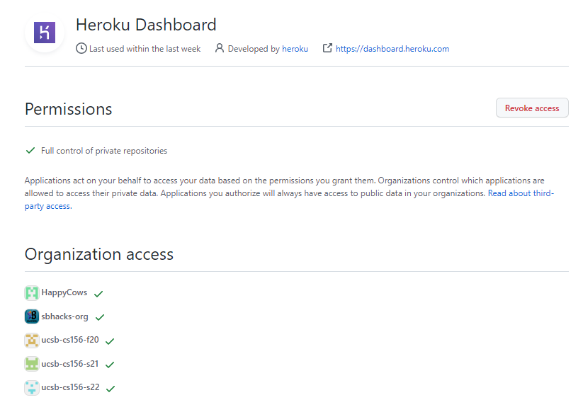
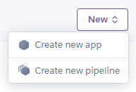
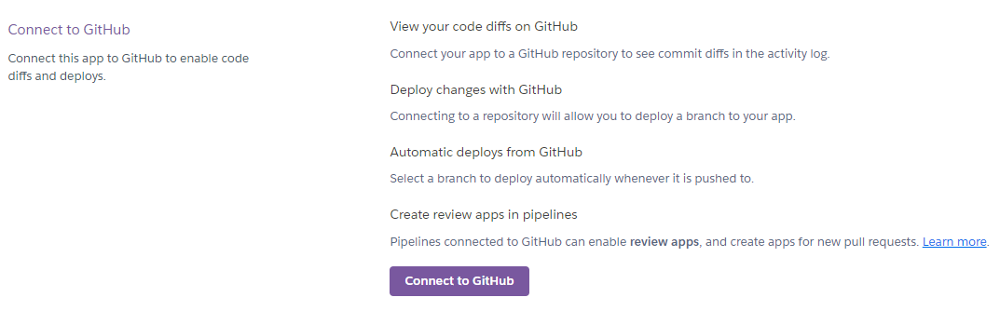
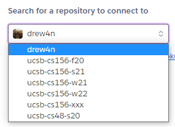

# {{ page.title }}

Before you can deploy apps within your new GitHub organization to Heroku, you'll need to grant Heroku permission to access repositories within the org. This only needs to be done once per organization and can be done by any organization owner.

### If you have used Heroku with GitHub before:

1. Visit the [GitHub homepage](https://github.com/) and sign in to an owner's GitHub account.
2. When signed in, navigate to the [Heroku Dashboard OAuth Application page](https://github.com/settings/connections/applications/2bde25e3844dcbccc16d). This page will only appear if you've previously used OAuth to authorize in Heroku Dashboard.
    * The page should look like this:

        

3. Under "Organization access", find your class GitHub organization and click "Grant". Enter your password if prompted.
    
    

    * If the organization has a green check instead of a red "X", an owner has already granted access and Heroku already has permissions to access your organization's repos, so nothing needs to be done.
    * If the button shows "Request" instead of "Grant", then you don't have owner permissions to the organization. You can click "Request", which will forward the request to all owners, one of which can approve the request. 

### If you have not used Heroku with GitHub before (or have not used Heroku at all):

1. Visit the [GitHub homepage](https://github.com/) and sign in to an owner's GitHub account.
2. Visit the [Heroku Dashboard](https://dashboard.heroku.com/) and sign in or create a new account.
3. When signed in, use the "New" button on the top right corner to create a new application.

    

4. Give your app any name (that's not already in use - app names are shared globally) and choose the US region. Skip adding to a pipeline and create your app directly.
5. Upon creating your app, you'll be taken to your application's dashboard page. Navigate to the "Deploy" tab.

    

6. Once in the deploy tab, select "GitHub" as the deployment method.

    

7. You'll be presented with a screen asking to "Connect to GitHub". Click the button. This will open a pop-up window with GitHub OAuth.

    

8. Under "Organization access", find your class GitHub organization and click "Grant". Enter your password if prompted.
    
    

    * If the organization has a green check instead of a red "X", an owner has already granted access and Heroku already has permissions to access your organization's repos, so nothing needs to be done.
    * If the button shows "Request" instead of "Grant", then you don't have owner permissions to the organization. You can click "Request", which will forward the request to all owners, one of which can approve the request. 

9. Finally, click the green button to "Authorize heroku".
10. You should be taken back to your app's dashboard on Heroku. To verify that permissions were granted, under "Select for a repository to connect to", click your username. Ensure that your class organization appears as an option.

    

