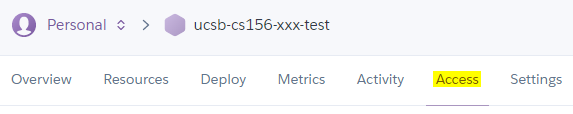
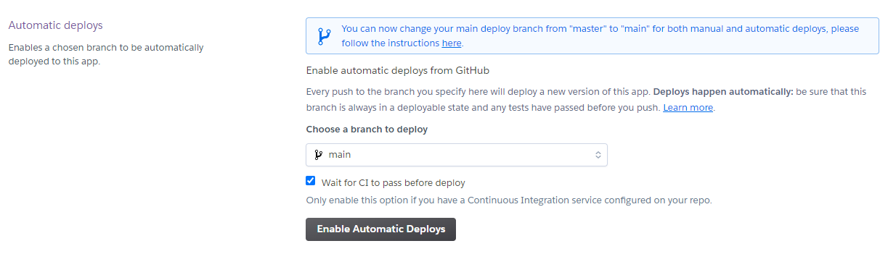
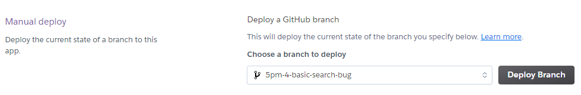
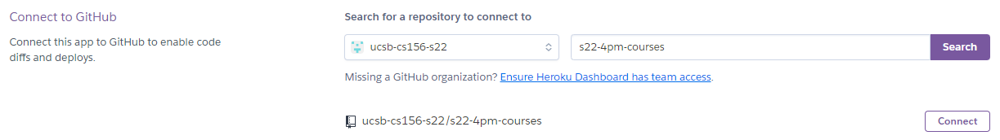
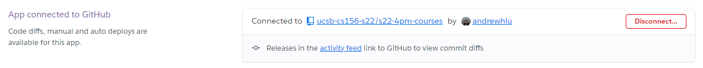

# {{ page.title }}

Heroku's robust support for almost all modern tech stacks makes deploying applications to Heroku fairly trivial, but in CMPSC 156, there is a specific structure we use for deploying team and project applications, especially for the legacy code project. This document aims to outline these procedures.

All of these deployment instructions rely on Heroku's GitHub integration, so be sure you have set that up. Alternative instructions for deployment using Heroku Git are listed at the end.

## Individual Student Assignments

In individual programming assignments such as JPAs, students are expected to establish their own Heroku apps and deploy from their own private repositories as part of learning the course tech stack. Introductory assignments are designed to be simple and usually only involve setting a few configuration variables before deploying to production.

Since Heroku application names must be globally unique, we establish a naming convention for apps in a way that should prevent future conflicts. 

In Winter 2022 and Spring 2022, the naming convention is:

`jpaxx-ucsbnetid`

where:

* `jpaxx` is the name of the assignment (e.g. `jpa03`)
* `ucsbnetid` is a student's UCSB NetID (e.g. `joegaucho`)
  * Due to Heroku limitations, application IDs must be all lowercase, and a dash (`-`) must be used in place of underscores (`_`) and periods (`.`) in NetIDs.

The above should ensure uniqueness. In the past, we have also included the following, but this has since been removed, likely due to the length restriction of 30 characters in Heroku app names.

* the university abbreviation (`ucsb`)
* the name of the course (`cs156`)

Due to the limitations of un-verified Heroku accounts on the free tier, students are encouraged to delete apps created for these introductory assignments as soon as they receive confirmation that the assignment has been graded. Staff are also encouraged to be on top of grading to ensure that students do not reach their quota of applications. 

See the "Free Tier Limitations" page for more on these limitations.

## Team Student Assignments

In team assignments (e.g. team01), student teams share ownership of a single project and submit pull requests to a shared repository (as opposed to directly contributing to individual student repositories). Because ownership of the repository is shared, access of any Heroku deployments must also be shared with the team and the staff.

Team assignments are also designed to introduce students to the various stages of development, such as QA and Production. As a result, each team is expected to create and maintain one "Production" Heroku deployment that is up to date with the main branch, as well as at least one "QA" Heroku deployment that can be used for testing individual changes in pull requests.

### Creating team deployments

Due to the limitations of un-verified Heroku accounts on the free tier, the owners of the "Production" and "QA" apps should be two different students. This will help ensure that students do not exceed the app count and dyno hour limits.

App names should follow this convention:

* `teamname-assignmentname` for Production
* `teamname-assignmentname-qa` for QA

where:

* `teamname` is the name of the team (e.g. `s22-4pm-1`)
* `assignmentname` is the name of the assignment (e.g. `team01`)

After an app is created, students can use the "Access" tab to grant collaborator privileges other members of the team, as well as the staff.



### Production Deployment

For "Production" deployments, teams are encouraged to use the GitHub integration to enable automatic deployments from the main branch. This ensures that the production deployment will always be up to date following a pull request that has been merged in. Since we have GitHub Actions enabled as our CI provider, we can additionally enforce the constraint to "wait for CI to pass before deploy".



### QA Deployments

Quality Assurance (QA) deployments are "production-like" environments that can be used to confirm / test a code change's functionality before a pull request is finally approved and merged into the main branch. Testing changes in a QA environment helps to ensure that the code being merged in is functionally correct and no regressions are introduced.

As the QA deployment is to be used for individual branch reviews, automatic deployments should NOT be enabled. Instead, when reviewing a pull request, a code reviewer should use the "Manual deploy" section to manually deploy the branch being reviewed.



As this deployment is a shared deployment, team members should be encouraged to inform each other whenever new deployments are made, so as to prevent concurrent usage of the deployment by multiple members of the team.

## The Legacy Code Project

The legacy code project phase of the course presents some new challenges in regards to deploying to Heroku, mainly due to the addition of branch protections in this stage of the course. As the project repos are "owned" by the staff instead of the students, the step to link a GitHub repository to a Heroku deployment will have to be done by a staff member.

### Production and QA deployments

Like the team assignments, we use the notion of "Production" and "QA" in the legacy code project, and each team will maintain their own QA deployment as before. Unlike the team assignments, however, each instance of the legacy code application only has one "Production" environment which is shared among all the teams that build for it. 

App names should follow this convention:

* `sectionid-projectname` for Production
* `teamname-projectname-qa` for QA

where:

* `sectionid` is an identifier for the quarter and section, similar to the team name (e.g. `s22-4pm`)
* `teamname` is the name of the team (e.g. `s22-4pm-1`)
* `projectname` is the name of the assignment (e.g. `happycows`)

To set up the Production deployment:

1. (Student / Staff) Assign one team to work on setting up Heroku Production while the other team sets up Storybook (assuming two teams work on each repository)
2. (Student) Have one student create a new Production application using the above naming convention.
3. Invite the following people as collaborators:
    * All members of the owner's team
    * All members of the course staff
    * One member from *every other team* working in the same repository
4. Instruct the one member from every other team to add the remainder of their team's members
5. Request the staff to link your team's repository to your Heroku deployment
6. (Staff) Log in to your Heroku Dashboard and visit the application's page. Navigate to the "Deploy" tab.
7. In "Connect to GitHub", select the class GitHub organization, enter the repository's name, and click "Search".
8. Find the desired repository and click "Connect". 

    

9. If successful, the Heroku interface should show that you connected the application to GitHub.

    

    After this stage, **do NOT unlink the GitHub repository!**

10. (Student) Return to the "Deploy" page and find the "Automatic deploys" section. Ensure that the main branch is selected, enable "Wait for CI to pass before deploy", and click "Enable Automatic Deploys".

    

Each team should also set up their own QA deployment. To set this up:

1. (Student) Have one student (different than the Production app creator) create a new QA application using the above naming convention.
2. Invite the following people as collaborators:
    * All members of the owner's team
    * All members of the course staff
3. Request the staff to link your team's repository to your Heroku deployment
4. (Staff) Log in to your Heroku Dashboard and visit the application's page. Navigate to the "Deploy" tab.
5. In "Connect to GitHub", select the class GitHub organization, enter the repository's name, and click "Search".
6. Find the desired repository and click "Connect". 

    

7. If successful, the Heroku interface should show that you connected the application to GitHub.

    

    After this stage, **do NOT unlink the GitHub repository!**

As before, each team will manage their own QA deployment for the purposes of code review. The staff will use this deployment to test each code review before merging into the main branch. Because of the high volume of pull requests and the large number of people that touch the codebase and deployment, it is very helpful to post in a team's Slack channel whenever the QA deployment is in use.

## Database Resets

Many feature additions require changes to database schemas, whether it's a new field that's added to provide new functionality, or a column that is moved or deleted due to a refactoring. As our environments aren't set up to properly migrate databases whenever the schema is changed, you may occasionally find yourself with a non-functional application after a new feature is pushed.

Resetting the Heroku Postgres database can help here. The below command will reset the database for the Heroku app identified by `app-name-here`. 

**Note that database resets are irreversible and will lead to data loss!**

```
heroku pg:reset --app app-name-here
```

This is especially useful when debugging issues on QA (e.g. in a code review) before merging to the upstream branch.
