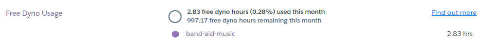
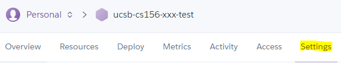
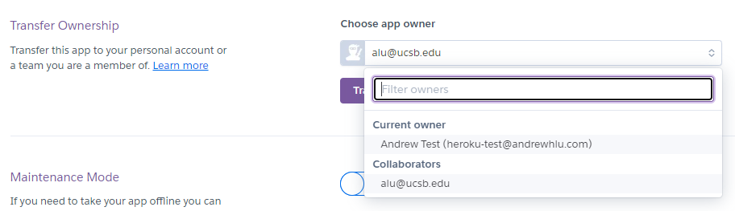
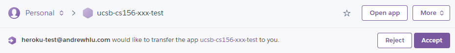

# {{ page.title }}

NOTE: The following content will be obsolete as of November 28, 2022, 
when Heroku will be [removing it's free tier](https://help.heroku.com/RSBRUH58/removal-of-heroku-free-product-plans-faq)

When selecting a tech stack for this course, we look for technologies with a free tier that can be reasonably used without needing to provide any payment information. Everything in this course must be free to use (with or without education discounts) without needing a credit card.

Heroku has a free tier that can be used without a credit card, and such accounts are referred to as "unverified" accounts. The differences between "unverified" and "verified" accounts are summarized below:

| Restriction | Unverified | Verified |
|-------------|------------|----------|
| Maximum Number of Free Applications | 5 | 100 |
| Free App Dyno Hours per month | 550 | 1000 |
| Custom Domain Support (not used in CS 156) | ❌ | ✔ |

We are not allowed to require students to input credit cards into Heroku, and as a result, we expect that most (if not all) students will hold "unverified" accounts. 

To avoid running into issues with the first two limitations above, we use the following strategies:

### 1. Staggering Ownership of Applications within Teams

In team programming assignments, such as team01, students should select two different members of the team to own the Production and QA deployments. This will allow each student to only occupy one of their five app slots, and for dyno hours to be equally distributed.

Additionally. for subsequent assignments, students should select two people who were not previously chosen to "own" apps to own the next apps. This ensures that, while previous assignments are in the process of being graded, they are not taken down due to quotas being consumed by future apps.

For example, assume that there is a team of six people (A - F) and four team assignments (team01 - team04). One possible way to stagger ownership of applications is:

* A for team01 prod, B for team01 QA
* C for team02 prod, D for team02 QA
* E for team03 prod, F for team03 QA
* A for team04 prod, B for team04 QA

Keep in mind that everyone on the team can be added as a "collaborator" - you don't necessarily have to be an application owner to make new deployments and use the app. Additionally, apps that you are a collaborator of do not count toward your free app quota.

### 2. Prompt Grading of Heroku Assignments

To avoid running into application count quota issues, it is also helpful for staff to promptly grade programming assignments. Quickly grading programming assignments allows students to delete unused / finished applications as soon as a grade is released for it, making room for future apps they may need to make in the future, whether it's a shared team application or a personal QA environment for testing.

### 3. Rotating App Owners when out of free Dyno Hours

If a student or staff member runs out of free Dyno hours for the month to keep their app(s) running, they can transfer the app to another student or staff member that has available Dyno hours.

You can see your "Free Dyno Usage" quota, as well as a list of apps that have been consuming your quota, [here](https://dashboard.heroku.com/account/billing).
  * You can also get here by selecting your avatar on the top right corner, clicking on "Account settings", and then clicking  on the "Billing" tab.

To change ownership of an application:

1. Log into the current app owner's Heroku account and open the app in the Heroku Dashboard.
2. Ensure that the new owner is added as a collaborator on the application in the "Access" tab.
3. Navigate to the "Settings" tab.

    

4. Scroll to the bottom of the page and look for "Transfer Ownership". In the dropdown, select the collaborator you wish to transfer ownership to, and click "Transfer app...".

    

5. Confirm the transfer in the modal that appears. The new owner will then be prompted to accept the transfer.
6. Log into the new app owner's Heroku account and open the app in the Heroku Dashboard.
7. On the top of the page, you will see the request to transfer ownership. Click "Accept" and confirm the acceptance in the modal that appears.

    

If the above steps don't work or fails otherwise, another alternative is to simply create a new Heroku application entirely, using a different Heroku account, instead of migrating. Students can simply follow the setup instructions again using a temporary app name, asking the staff to re-link the GitHub repo when needed.
