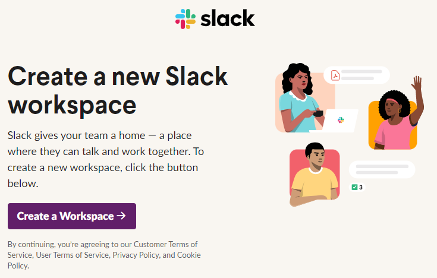
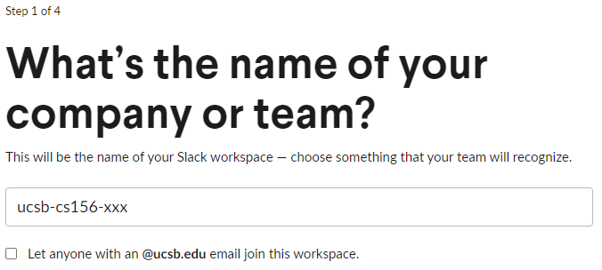
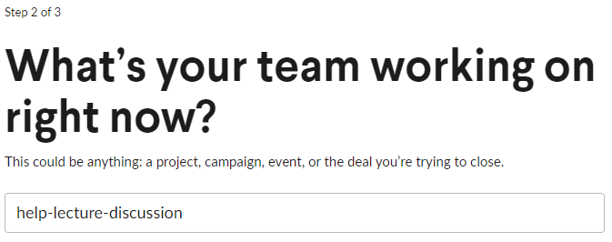
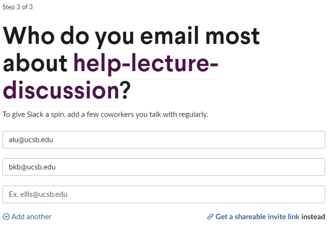
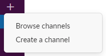
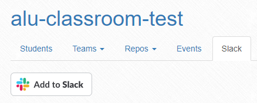
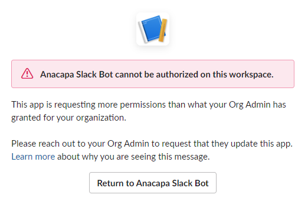

# {{ page.title }}

This guide will walk through the process of creating a new instance of Slack, referred to as a "workspace". Slack workspaces are entirely independent of each other, so every workspace member, regardless of whether they have previously used Slack, will have the same experience with the tool.

## Creating the Workspace

1. Visit [this link](https://slack.com/get-started) to start the creation of a new Slack workspace.
    * You can also get here by visiting the [Slack homepage](https://slack.com/) clicking "Try for free".
2. Authenticate yourself using your @ucsb.edu email. This will be the email tied to your Slack profile for your new instance.
    * You can authenticate yourself using either email + one-time PIN or Google OAuth.
3. On the landing page, select the button to "Create a Workspace". A new workspace will be created, and you'll be taken to the setup pages.

    

4. In the first setup step, enter `ucsb-cs156-xxx` as the name of the team, replacing `xxx` with the quarter code, and **uncheck** the option to "Let anyone with an @ucsb.edu email join this workspace".
    * The team name should match the GitHub organization name.

    

5. Click "Next" to proceed. Skip the second step by clicking "Skip this step" - the students will add themselves into the organization using a shared invitation link.

    

6. The third setup step creates your first channel (aside from #general and #random). For now, we can use it to generate the `help-lecture-discussion` channel by inputting it as the value and clicking "Next".

    

7. The last setup step includes a place to invite members to the workspace through email and through a shareable link. We'll use both.
   1. First, click "Get a shareable invite link" to copy an invite link to your clipboard. **Paste this link somewhere safe**. You'll use that to invite students in your initial email (see GauchoSpace instructions).
   2. In the box to enter an email address, enter the email address of the first staff member you wish to invite.
   3. After entering the first email address, a new email box should appear. Repeat the above step for each staff member you wish to invite.
   4. After adding all staff members, click "Add teammates". Your staff will receive an invitation to join via email.

    

8. You'll be taken to your new Slack workspace (and/or asked to open it in your Slack client). Before we invite students, we'll need to establish some channels and change some settings.

## Creating Workspace Channels

The full list of channels that will be created over time is viewable in the "Channels" document. For now, we'll start by establishing only the ones necessary for the beginning of the course.

### The #general and #announcements channels

In the Slack free plan, only the initial #general channel allows for channel posting permissions to be restricted. Because of this, we will make this the #announcements channel and restrict posting permissions to only members of the staff. This ensures that there is a clutter-free place for students to see high-priority announcements from the staff.

1. Open your Slack workspace and navigate to #general
2. On the top of the channel, click the channel name to open the channel details.
3. In the modal window, click on the "Settings" tab and make the following changes:
   1. Click "Edit" next to "Channel name". Rename this channel to "announcements".
   2. Click "Edit" next to "Posting permissions". Select "Admins only" as the new posting permission. 
        * You'll make the rest of your staff "Workspace Admins" later
   3. Be sure to save changes after each step.

Now that the #general channel has been repurposed to be the #announcements channel, we can create a new #general channel for general discussion in the course.

To create a new channel:

1. Hover over "Channels" in the left sidebar. This reveals two additional buttons: three dots and a plus symbol. Click the plus symbol.

    

2. In the revealed dropdown, click "Create a channel".

    

3. Enter the desired channel name and optional description, and select whether the channel should be private. Then click "Create".
    * Note that once a channel is made private, it cannot be made public again.
4. Once the channel is created, you'll be prompted to add members and, if the channel is public and you are an admin, optionally set it as a default channel.

### Other Channels

After the above step, you should have four public channels established:

* #announcements
* #general
* #help-lecture-discussion
* #random

To get started with the course, it may be helpful to establish the following channels (as non-default channels):

* Public channels
  * Legacy code project channels (prefixed with `proj-`)
    * #proj-courses
    * #proj-happycows
  * Section Swaps channel
    * #section-swaps
  * Additional Help Channels (prefixed with `help-`)
    * #help-hwk
    * #help-setup-linux-wsl
    * #help-setup-macos
  * Article sharing channel
    * #articles
  * Bot integration channel (for Anacapa Slack Bot)
    * #bots
* Private staff channels
  * General staff channel
    * 🔒staff
  * Staff legacy code project channels
    * 🔒staff-proj-courses
    * 🔒staff-proj-happycows
  * Timecard Approval Request channel (only for instructor and paid ULAs)
    * 🔒staff-timecards

## Setting Up Workspace Apps

Slack can easily integrate with other services through the use of Slack Apps. We use three such apps in our workspaces:

* GitHub
* Zoom
* Anacapa Slack Bot

The first two are public applications and are readily available through the Slack app directory. The last, Anacapa Slack Bot, is the custom Slack bot designed to integrate with the UCSB CS GitHub Linker, and must be installed through the linker tool itself.

### Install GitHub and Zoom

1. Navigate to the app in your web browser:
   * [GitHub](https://slack.com/apps/A01BP7R4KNY-github)
   * [Zoom](https://slack.com/apps/A5GE9BMQC-zoom)
2. On the top right corner, ensure that your workspace is selected.
3. Click the green "Add to Slack" button to add the app.
4. (For Zoom only) On the "Select a Way to Add Zoom" page, select the button under "Zoom for Yourself". Each student will have to authenticate with their own Zoom account if they choose to use the integration.
5. Click "Allow" in the Slack OAuth dialog that appears.
6. The app has been added to your workspace, and you'll receive a welcome message in Slack. Follow the instructions there to link your Zoom or GitHub account.

### Install Anacapa Slack Bot

Before starting, ensure that you have followed the instructions to set up your class in the UCSB CS GitHub Linker tool, and a public #bots channel has been established in your workspace.

1. Log in to the [UCSB CS GitHub Linker](https://ucsb-cs-github-linker.herokuapp.com/courses) and navigate to your course.
2. Click on the "Slack" tab and then click on the "Add to Slack" button.

    

3. Slack's OAuth page should open. Ensure that your workspace is selected on the top right corner.
4. Under "Where should Anacapa Slack Bot post?", select your #bots channel. Then click "Allow".
5. Slack may send a six-digit code to your email. If prompted, enter the code.
6. On success, you'll be redirected back to the GitHub linker tool, and a green alert stating "Successfully added Slack workspace" will be displayed.
    * If instead you see the below error message, try adding the app again and the permissions should resolve. If not, contact Phill Conrad at <phtcon@ucsb.edu>.

        

## Changing Workspace Settings

1. Start by navigating to your workspace's "Admin Settings".
   * Click on your workspace name on the top left, then "Settings & administration", then "Workspace settings".
   * You can also navigate to the page directly by visiting `https://ucsb-cs156-xxx.slack.com/admin/settings`, replacing `xxx` with the quarter code.
2. In the main "Settings" tab, change the following settings. Be sure to save after every change.
   1. Expand the "Default Channels" section and change the following settings:
      1. Ensure that the bolded channel inside the parentheses is #announcements.
            * If #announcements is not the bolded channel, then please follow the steps in the section above to rename the initial #general channel to #announcements.
      2. In the list of channels that new members will be automatically added to, add these channels if not already present:
            * #general
            * #help-lecture-discussion
            * #random
      3. In the dropdown for the channel members should start in, select #announcements.
   2. Under "Pronouns Display" check "Show pronouns on profiles".
   3. Under "Channel Join & Leave Messages", uncheck "Show a message when people join or leave channels".
   4. Under "Notify of new users", uncheck "Notify everyone when a new teammate joins".
   5. Under "Calls", uncheck "Slack" and check "Zoom" from the list of calling options.
3. On the left sidebar, under "Administration", click on "Manage members". Promote each member of your course staff to "Workspace Admin".
    1. Select the three dots next to a staff member's name.
    2. Select "Change account type" in the dropdown.
    3. Select "Workspace Admin" as the new account type and click "Save".
4. On the left sidebar, under "Administration", click on "Billing". Disable the ability for non-admins to upgrade the workspace.
    1. Open the "Settings" tab on the billing page.
    2. On the bottom of the page, under "Who can purchase Slack", select "Only Workspace Owners".
    3. (Optional) Uncheck "Allow free trials to start automatically" if you don't want the workspace to automatically start the Slack Pro trial.
       * This may be helpful incase you have a need to start your free trial later on to recover an old message, for example.
    4. Save your settings.
