# Codecov

Codecov is a service that aggregates code coverage metrics for software codebases. The product allows users to see, store, and track code coverage from a variety of languages and testing frameworks, and use these metrics to provide insights and enforce checks. Through its GitHub integration, Codecov can automatically gather code coverage data from GitHub Actions CI runs, provide coverage reports directly in pull requests, and prevent code merges if coverage thresholds are not met.

In enforcing code coverage thresholds, Codecov reports two types of statuses: "Project" statuses, which compares overall project coverage, and "Patch" status, which only looks at code coverage for changed lines in a pull request.

Learn more about Codecov on their [website homepage](https://about.codecov.io/).

## Codecov in CMPSC 156

Codecov is used in CMPSC 156 to:

* View code coverage of repositories on GitHub

  Codecov can be used to present coverage results for repositories hosted in GitHub, eliminating the need to clone a repository and run a test suite manually. Additionally, since Codecov stores all uploaded code coverage reports, code coverage in a repository can be tracked over time.

* Combine test coverage results from our Spring Boot backend and React frontend Actions runs into one unified, user-friendly view

  Since our codebase features different languages / frameworks for frontend and backend code, tests for each remain independent of each other. While this can be useful in development, it can be hard to analyze the overall codebase's coverage in production or in code review. Codecov is able to aggregate the coverage reports from both Jacoco and Jest into a single report with a user-friendly website.

  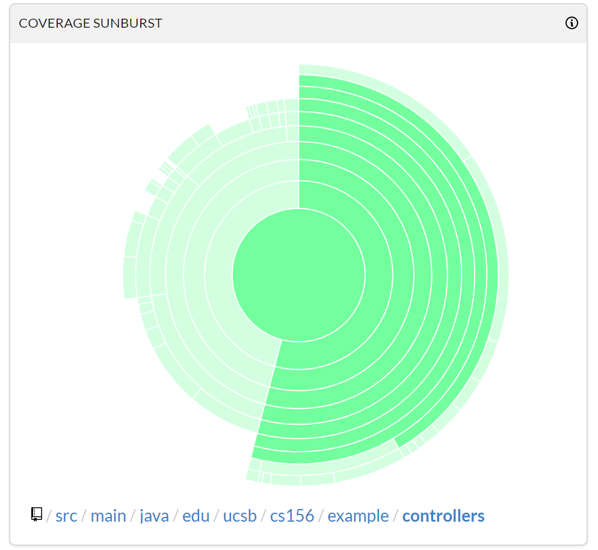

* Provide summarized coverage reports inline in GitHub Pull Requests

  With Codecov's GitHub integration, once a pull request's coverage CI runs have completed, Codecov can post a summary of the pull request's changes and code coverage as a comment inline in the pull request review thread. This allows reviewers to easily glance at the coverage of changes being reviewed.

  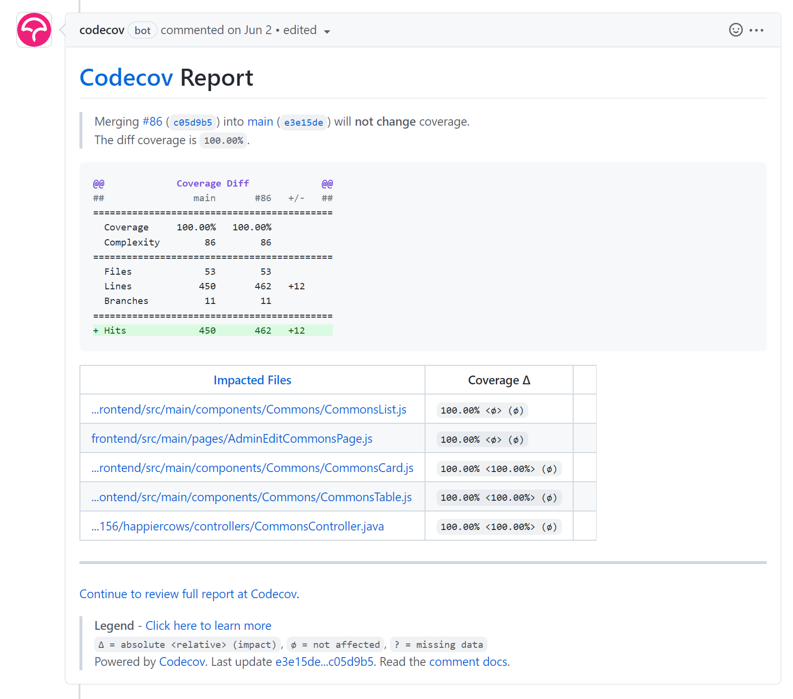

* View dropped coverage inline using GitHub's diff view

  In addition to proving the above PR summary, Codecov is also able to add inline code review comments on places with incomplete coverage.

  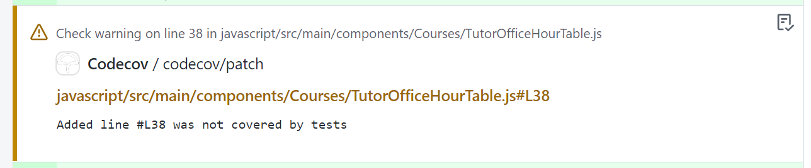

* Enforce coverage thresholds for individual PRs and entire repositories

  Codecov performs two types of status checks:

  * "Project" checks, which look at the entire codebase's code coverage
  * "Patch" checks, which only look at the coverage of changed lines

  For each one, Codecov allows project owners to enforce a coverage threshold. This threshold value indicates the allowed percentage drop for each check that will constitute a "passing" check, when compared to the coverage of the base of the branch. 

  Repositories in this class use the [default Codecov settings](https://docs.codecov.com/docs/commit-status) and therefore do not have a `codecov.yml` file defined. The default settings define a 0% coverage diff threshold for both checks, which means that *any* drop in coverage will result in a failed check in pull requests.

  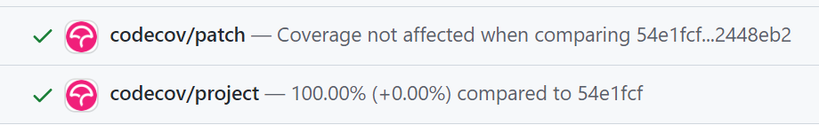

* Provide a code coverage badge in project READMEs

  A clickable badge, like the one below for demo-spring-react-example, can be added to a project's documentation or README as an easy way to access Codecov coverage reports.

  [](https://codecov.io/gh/ucsb-cs156/demo-spring-react-example)

## Codecov and the GitHub Student Developer Pack

Codecov is free for open-source (public) projects. but is paid for private projects if more than five users are needed. However, Codecov is part of the [GitHub Student Developer Pack](https://education.github.com/pack), and verified students won't occupy any seats within a Codecov organization. As a result, **students will need to register for the GitHub Student Developer Pack before using Codecov**. Teachers, however, will continue to take up a slot, even if registered as a faculty member through GitHub, as educators do not get the same benefits.

To ensure that we do not exceed our private user quota reserved for staff without a student affiliation, **staff will need to manually validate students** as they register for Codecov to make sure they have correctly signed up. We make use of the [#help-codecov channel](../slack/3-channels.md#help-codecov) in Slack to facilitate such requests to activate students.

Instructions to validate students are listed in the [Codecov Initial Setup document](3-codecov-initial-setup.md#verifying-github-students).

## Setting Up Repositories in Codecov

A few things should be done / checked when setting up a repository for the first time. These are usually left for the students to complete as a setup task.

### Set GitHub Actions `CODECOV_TOKEN` for private repos

Any public repositories in your organization will automatically be set up in Codecov along with the first coverage upload in a GitHub Actions coverage run. Public repositories do not need a Codecov token to function.

Private repositories, however, need a Codecov token when uploading coverage reports to Codecov. This value can be obtained from the Codecov interface, and set as a repository secret within the GitHub repo for use in Actions runs.

**Note that this can only be performed by repository admins**. For programming and team assignments, students will generally have admin access to their repositories. Students won't be admins of the legacy code project repos, but those should already be public, and therefore do not need a token.

1. Visit your repository's page in Codecov.
    * You can navigate to it directly by substituting your organization and repository name into the following link:

        ```
        https://app.codecov.io/gh/ucsb-cs156-xxx/private-repo-name
        ```

    * You can also navigate to this page by visiting the [Codecov dashboard](https://app.codecov.io/gh), selecting your organization, selecting "Not yet setup" on the top right (above the table), and then selecting your repository.

2. You should be taken to a setup page titled "Let's get your repo covered". Under "Step 2", copy your Codecov token value by clicking on the blue clipboard. The token takes the format of a UUID.

    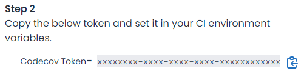

3. Navigate to your project repository's Settings page.
4. On the left sidebar, under "Security", click "Secrets" and then "Actions".
5. On the top right, next to "Actions secrets", click "New repository secret".

    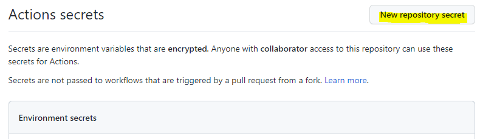

6. Under "Name", enter `CODECOV_TOKEN`.
7. Under "Value", paste your Codecov token value from above. Ensure that there are no extra characters or line breaks.

    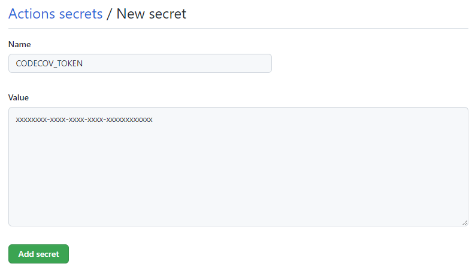

8. Click "Add secret" to save the new token value.

### Establish Base Coverage Report

Now that the `CODECOV_TOKEN` has been set, in order for pull request coverage status to have a baseline to compare to, we need establish a base coverage report for what's currently on top of the `main` branch.

If a repository is initialized from a template using either GitHub's template feature or push of an existing repo to the new empty repository, and the codebase already has the GitHub Actions workflows found in the latest [demo-spring-react-example](https://github.com/ucsb-cs156/demo-spring-react-example) included, then an initial GitHub Actions run will generate a base coverage report for you. You won't need to follow the steps below.

However, if you *transfer an existing repository* into the organization instead of initializing a new one, you'll need to establish a new base coverage report, since coverage reports from the previous repository owner / name will not transfer over. (In other words, Codecov has no way of knowing you transferred the repository.)

To establish (or re-establish) a base coverage report:

1. Navigate to your project repository on GitHub.
2. On the repository navigation bar, select the "Actions" tab.

    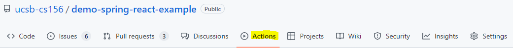

3. Run the *Java Jacoco* workflow.
   1. On the left sidebar, select the Actions workflow titled `12-backend-jacoco: Java Test Coverage (Jacoco)`
   2. In the blue dialog that states "This workflow has a `workflow_dispatch` event trigger.", click on "Run workflow", then "Run workflow" again.

       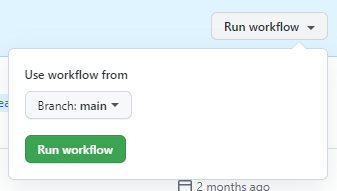

   3. The workflow to run the Java backend coverage report will now run in the background and take approximately one minute.

4. Run the *JavaScript Jest* workflow.
   1. On the left sidebar, select the Actions workflow titled `32-frontend-coverage: Frontend Coverage (JavaScript/Jest)`
   2. In the blue dialog that states "This workflow has a `workflow_dispatch` event trigger.", click on "Run workflow", then "Run workflow" again.
   3. The workflow to run the JavaScript frontend coverage report will now run in the background and take approximately two minutes.

5. After both runs finish, and the Actions log shows a successful coverage upload, return to the Codecov dashboard and ensure that the `main` branch head's commit hash appears with a coverage report.

### Set Codecov's Default Branch

On October 1, 2020, GitHub announced that [the default branch for any newly-created repositories is now `main`](https://github.blog/changelog/2020-10-01-the-default-branch-for-newly-created-repositories-is-now-main/), moving away from the previous default `master` to create a more inclusive environment. However, Codecov occasionally has trouble picking up the new branch name, and will sometimes set its default branch to `master`. If this is the case, the repository dashboard page on Codecov will appear as though it has not been set up, even though coverage reports successfully upload.

Before following these steps, ensure that at least one Codecov coverage upload has successfully completed.

To change or verify that the default branch is `main` in Codecov:

1. Visit your repository's page in Codecov.
    * You can navigate to it directly by substituting your organization and repository name into the following link:

        ```
        https://app.codecov.io/gh/ucsb-cs156-xxx/private-repo-name
        ```

    * You can also navigate to this page by visiting the [Codecov dashboard](https://app.codecov.io/gh), selecting your organization, selecting "Not yet setup" on the top right (above the table), and then selecting your repository.

2. In the dashboard navigation bar, on the right, click the "Settings" tab.

    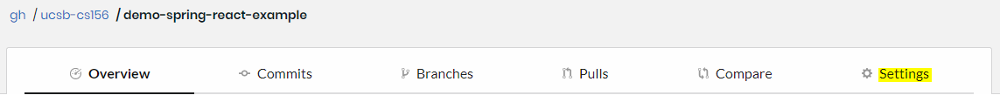

3. Under "Default Branch", ensure that `main` is selected in "Branch Context".

After updating the default branch, the main dashboard page should now show a proper code coverage report.

### Add Codecov README Badge

Codecov allows users to create status badges for Codecov repositories that can be added to a project website or README file. This badge allows users to see the unit test coverage for the entire project and navigate to the repository's Codecov page by clicking the badge.

The badge is provided in both Markdown and HTML format. We will use the Markdown format to add the badge to the README file.

1. Visit your repository's page in Codecov.
    * You can navigate to it directly by substituting your organization and repository name into the following link:

        ```
        https://app.codecov.io/gh/ucsb-cs156-xxx/private-repo-name
        ```

    * You can also navigate to this page by visiting the [Codecov dashboard](https://app.codecov.io/gh), selecting your organization, selecting "Not yet setup" on the top right (above the table), and then selecting your repository.

2. In the dashboard navigation bar, on the right, click the "Settings" tab.

    

3. On the left sidebar, click on "Badges & Graphs".
4. Under "Codecov badge" and "Markdown", copy the value by clicking on the blue clipboard on the right.

    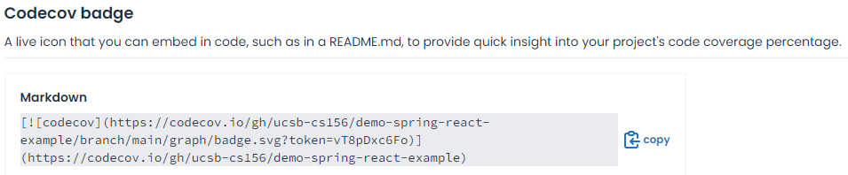

5. Paste the text contents just below the first header in the repository's `README.md` file and commit the change.
