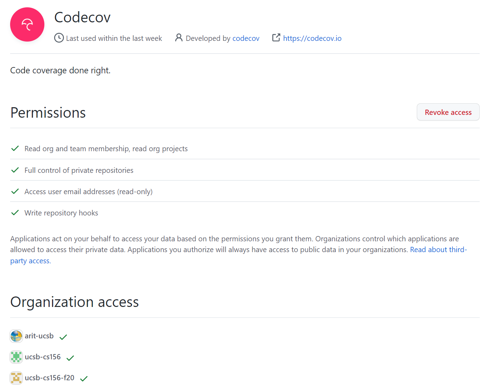
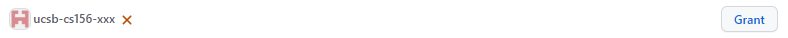
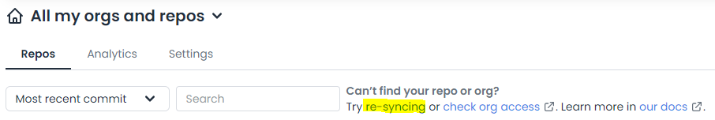
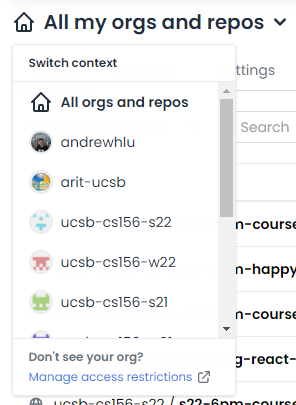
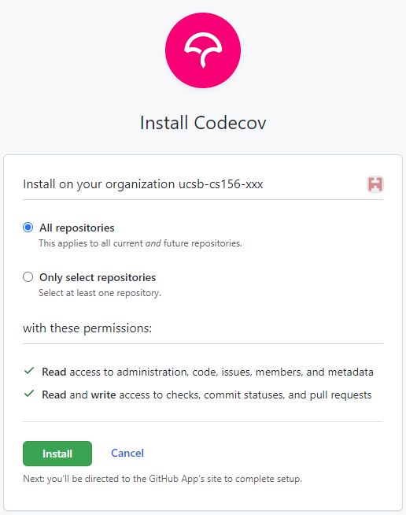

# Codecov Initial Setup

Before Codecov can be used within the organization, we must first grant permission to access the organization's repositories and members. This only needs to be done once per organization and can be done by any organization owner, regardless of GitHub student status.

## Grant OAuth Permission

This permission allows Codecov to access your public and private repositories, organizations, and webhooks.

### If you have logged into Codecov with GitHub before:

1. Visit the [GitHub homepage](https://github.com/) and sign in to an owner's GitHub account.
2. When signed in, navigate to the [Codecov OAuth Application page](https://github.com/settings/connections/applications/c68c81cbfd179a50784a). This page will only appear if you've previously used GitHub to sign in to Codecov.
    * The page should look like this:

        

3. Under "Organization access", find your class GitHub organization and click "Grant". Enter your password if prompted.
    
    

    * If the organization has a green check instead of a red "X", an owner has already granted access and Codecov already has permissions to access your organization's repos and members, so nothing needs to be done.
    * If the button shows "Request" instead of "Grant", then you don't have owner permissions to the organization. You can click "Request", which will forward the request to all owners, one of which can approve the request.
4. Visit the [Codecov dashboard](https://app.codecov.io/gh) and re-sync your account with Codecov by clicking the option next to the search bar.
    * This process may take a few minutes to complete.

    

5. After the sync is complete, on the top left, verify that your organization is present when "All my orgs and repos" is clicked.

    

### If you have not logged into Codecov with GitHub before

1. Visit the [GitHub homepage](https://github.com/) and sign in to an owner's GitHub account.
2. Visit [Codecov](https://app.codecov.io/login/gh) and select "Login with GitHub".
    * By default, this should log you in with both the Public and Private repo scopes. If you are given an option to select, be sure to allow private repository access.
3. Under "Organization access", find your class GitHub organization and click "Grant". Enter your password if prompted.
    
    

    * If the organization has a green check instead of a red "X", an owner has already granted access and Codecov already has permissions to access your organization's repos and members, so nothing needs to be done.
    * If the button shows "Request" instead of "Grant", then you don't have owner permissions to the organization. You can click "Request", which will forward the request to all owners, one of which can approve the request. 

4. Click the green button to "Authorize Codecov".
5. You should be taken to a list of repositories in Codecov. On the top left, verify that your organization is present when "All my orgs and repos" is clicked.

    

## Install Codecov GitHub App

In order for Codecov to post pull request comments and status checks, we need to additionally authorize access to Codecov's GitHub App. 

1. Visit the [GitHub homepage](https://github.com/) and sign in to an owner's GitHub account.
2. When signed in, visit the [Codecov App page](https://github.com/apps/codecov) and click "Install".
3. Under "Where do you want to install Codecov?", find and select your organization.
    * Organizations are listed in alphabetical order. You may have to navigate to multiple pages to find your repository.
    * If your repository is grayed out with the word "Configure", then another owner has already installed the application onto the account.
4. On the next page, be sure that permission to access "All repositories" is selected. Then click "Install".

    

## Verifying GitHub Students

In order for students to not occupy a seat in a Codecov organization, they must be verified as a student through [GitHub Student Developer Pack](https://education.github.com/pack), and Codecov must reflect this status in the organization member list.

Students can follow these instructions to obtain student status in Codecov:

1. Sign up and get approved for the [GitHub Student Developer Pack](https://education.github.com/pack).
    * This process should only take a few minutes if students have a verified UCSB email on their account.
    * Students can upload a picture of their student ID for verification, even if it does not show a date.
2. After getting approved, **sign into Codecov at least once**
    * Student statuses are only updated at login. If a student is already logged in from a previous session, they must sign out and sign back in.
3. When all of the above have been completed, post a message in #help-codecov with your GitHub username requesting to be activated on Codecov.

It is helpful to pin the following message in the #help-codecov channel for students:

> To set up your Codecov account, follow these instructions:
> 
> (a) Activate your GitHub Student Developer pack (if you didn't already do it) at https://education.github.com
> 
> (b) Once you've done that (or if you already did), log out of Codecov then back in again
> 
> (c) Ask for us to activate your account

When a student requests to be activated, staff can follow these steps to activate a student. This can be done by owners of the associated GitHub organization or anyone designated as an "admin" in Codecov's interface.

1. Visit the "Billing" page for your organization in Codecov
    * You can navigate directly to this page by substituting your class organization in the following URL:

        ```
        https://app.codecov.io/account/gh/ucsb-cs156-xxx/billing
        ```

    * You can also get to this page by clicking your profile picture on the Codecov dashboard, clicking "Settings", selecting your class organization from the dropdown on the top left where your username is present, and then clicking "Billing & Users" on the left sidebar.

2. Search for the student in the member list. Members are sorted alphabetically, first by GitHub profile name if one is present, then by username (for those who don't have a profile name).
3. Verify that the student has a "Student" badge.
    * If the student has a student badge, as shown below, toggle the switch next to the user until it shows "Activated" with a check.

        

    * If the student **does NOT** have a student badge, as shown below, do not activate the student. Instead, respond to the student's Slack message with the following:

        > We aren't able to see your student status. Can you follow the instructions in the pinned post, and then make a new request?

        It is helpful to link the pinned instruction post in the message. 

        
